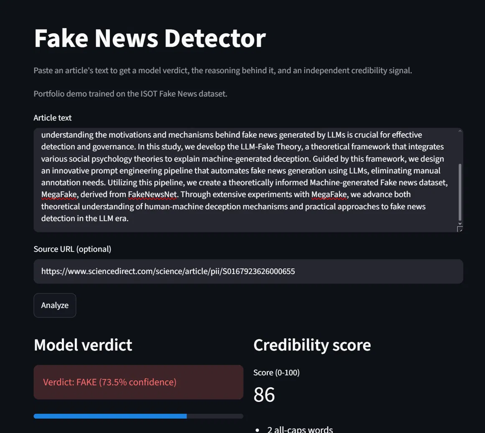
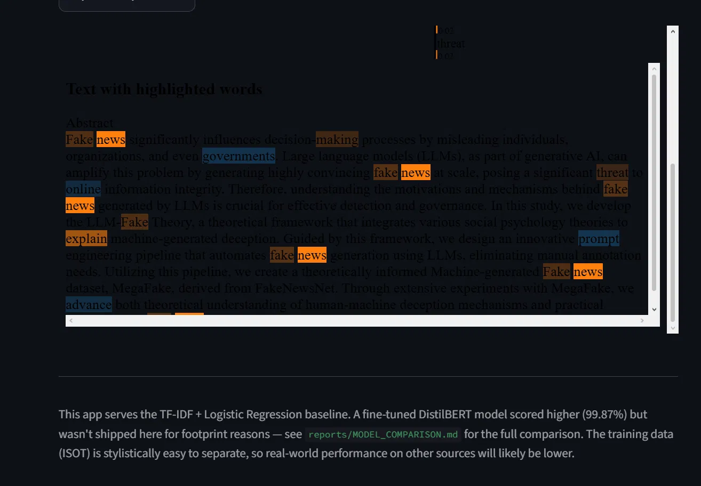
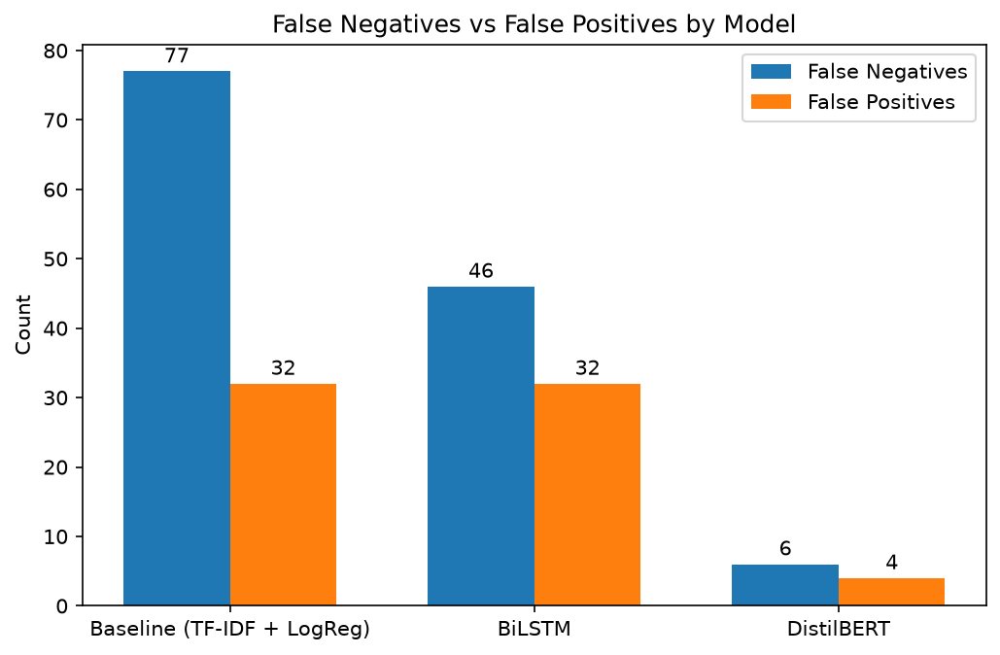
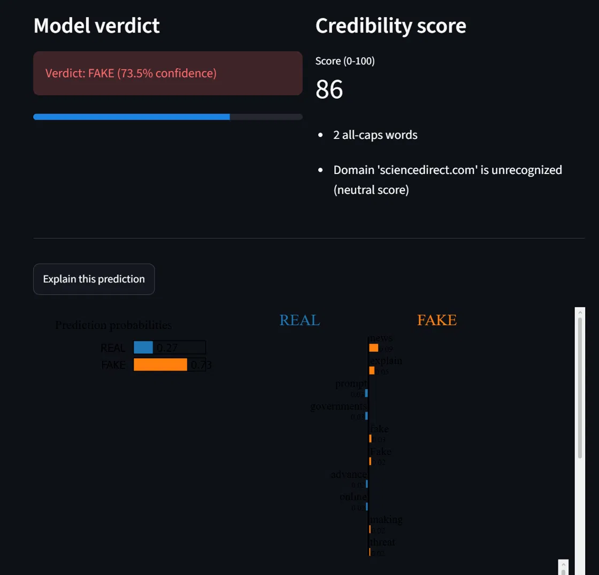
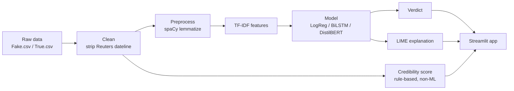

# Fake News Detector

An end-to-end NLP system that classifies news articles as **REAL** or **FAKE**, explains *why* with LIME, and cross-checks every verdict against an independent, non-ML credibility score. Built with Python, scikit-learn, spaCy, TensorFlow, Hugging Face Transformers, LIME, and Streamlit.

## Demo

**Verdict view** — model verdict, confidence, and the independent credibility score side by side.



**LIME explanation view** — highlights the words driving the verdict.



*Both screenshots use the same input: an academic abstract about fake news detection research — a deliberately tricky, non-obvious case. It's the subject of the [case study below](#known-limitation--topic-leakage-case-study), which explains the FAKE verdict and why the credibility score disagrees with it.*

## Results

Three models — TF-IDF + Logistic Regression, a BiLSTM, and DistilBERT — evaluated on the same 7,820-row held-out test set:

| Model | Training data | Accuracy | False negatives |
|---|---|---|---|
| Baseline (TF-IDF + LogReg) | 31,278 rows (full) | 98.61% | 77 |
| BiLSTM | 31,278 rows (full) | 99.00% | 46 |
| DistilBERT | 8,000 rows (~1/4) | 99.87% | 6 |



DistilBERT achieved the best result of the three despite training on roughly a quarter of the data available to the other models. Full breakdown in [reports/MODEL_COMPARISON.md](reports/MODEL_COMPARISON.md).

## Engineering decisions

**Data leakage.** The ISOT dataset's real articles nearly all carry a Reuters wire-service dateline (`WASHINGTON (Reuters) -`) that no fake article has — a model could learn to key off that string alone instead of the actual writing. It's stripped during cleaning in [src/data.py](src/data.py).

**Train/serve consistency.** Training and the live app both route text through the same `preprocess_text` function ([src/preprocess.py](src/preprocess.py)), so the model in production can never see differently-shaped input than the model it was evaluated as.

**Ship decision.** The deployed app serves the TF-IDF + Logistic Regression baseline, not DistilBERT. The baseline is a few hundred KB with no heavy dependencies, so it loads instantly and runs reliably on free hosting; DistilBERT's ~1GB torch/transformers footprint risks slow cold starts and OOM crashes for a ~1% accuracy gain that isn't worth the reliability risk in a demo. Details and trade-offs in [reports/MODEL_COMPARISON.md](reports/MODEL_COMPARISON.md).

## Known limitation — topic leakage (case study)

This is worth stating plainly: the model doesn't purely detect *deceptive writing style* — it partly detects *topic*.

Given an academic abstract *about* fake news detection research (not itself fake news), the model classified it **FAKE at 73.5% confidence**. LIME's explanation shows why: the words **"fake" and "news"** themselves were the top drivers of the prediction. The model learned that those tokens correlate with the FAKE class in training data, not that the text is deceptive.

The independent, rule-based credibility score rated the same text **86/100** — correctly recognizing it as credible. This is the practical case for shipping two independent signals rather than trusting the ML verdict alone.



## Architecture



## Setup & run

```bash
python -m venv venv
venv\Scripts\activate        # or: source venv/bin/activate on macOS/Linux
pip install -r requirements.txt
python -m spacy download en_core_web_sm
```

Download the [ISOT Fake News dataset](https://www.kaggle.com/datasets/clmentbisaillon/fake-and-real-news-dataset) from Kaggle and place `Fake.csv` and `True.csv` in `data/raw/`.

Run the pipeline in order:

```bash
python -m src.data              # clean + merge raw CSVs
python -m src.preprocess        # spaCy lemmatization -> processed CSV
python -m src.features          # TF-IDF vectorization + train/test split
python -m src.models.logistic   # train + save baseline model
python -m src.evaluate          # metrics, confusion matrix, report
```

Then launch the app:

```bash
streamlit run app.py
```

The BiLSTM and DistilBERT models are trained separately in Colab notebooks (not part of the local pipeline above) — see `reports/lstm_results.txt` and `reports/bert_results.txt` for their results.

## Project structure

```
app.py                      # Streamlit UI: verdict, LIME, credibility score
src/
  config.py                 # paths, label convention, random seed
  data.py                   # load + clean raw CSVs, strip Reuters dateline
  preprocess.py             # spaCy lemmatization -> clean tokens
  features.py                # TF-IDF vectorization + train/test split
  credibility.py             # independent rule-based credibility scoring
  explain.py                 # LIME explanation generation
  evaluate.py                 # model-agnostic evaluation harness
  compare_models.py          # builds the 3-model comparison table/chart
  models/
    logistic.py               # TF-IDF + Logistic Regression baseline (deployed)
    lstm.py                    # BiLSTM model (trained in Colab)
    bert.py                    # DistilBERT model (trained in Colab)
models/                     # saved model artifacts (.pkl / .keras)
reports/
  MODEL_COMPARISON.md        # full 3-model comparison write-up
  model_comparison.png       # comparison chart
  screenshots/                # app screenshots (see Demo)
data/
  raw/                        # Fake.csv, True.csv (not committed)
  processed/                  # cleaned/preprocessed CSVs
```

## Future work

- Fine-tune DistilBERT on the full 31,278-row training set instead of the 8,000-row subset.
- Train on a more diverse, multi-source corpus to reduce topic and source leakage.
- Serve the model behind a FastAPI endpoint.
- Containerize with Docker.
